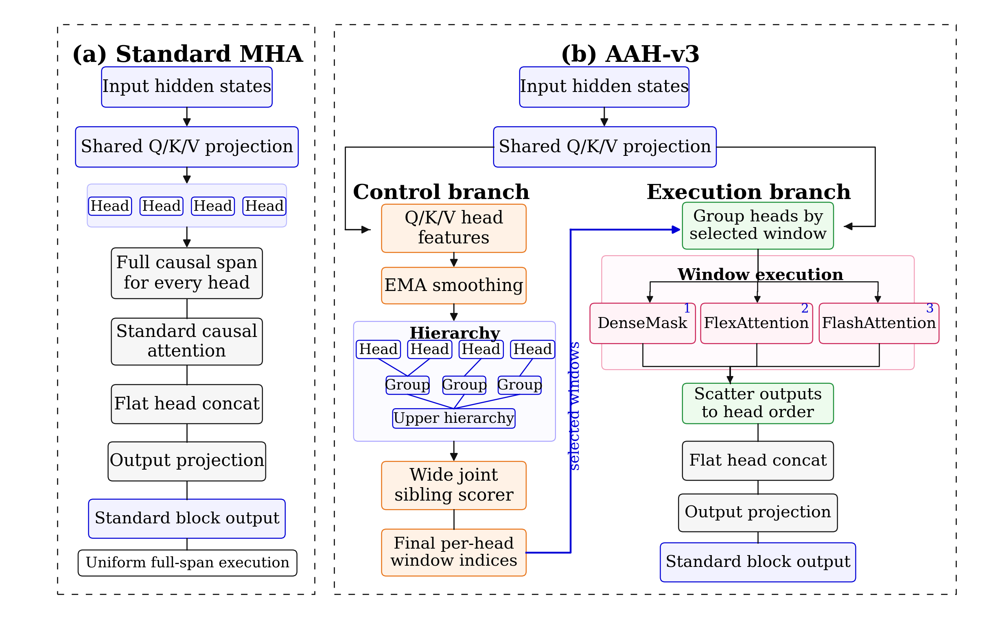

# ENA-AAH-v3

Research code and compact paper-facing summaries for **Asymmetric Attention
Heads (AAH-v3)**, a Transformer attention-control mechanism that assigns
different context windows to different attention heads or head groups while
preserving the standard Transformer block interface.

<p align="center">
  <a href="#overview">Overview</a> |
  <a href="#method">Method</a> |
  <a href="#claim-boundary">Claim Boundary</a> |
  <a href="#results">Results</a> |
  <a href="#setup">Setup</a> |
  <a href="#citation">Citation</a>
</p>

<p align="center">
  
</p>

This repository contains the AAH-v3 implementation, experiment configs, compact
paper-facing diagnostics, and release notes. It intentionally excludes large
checkpoints, raw W&B run directories, virtual environments, server credentials,
and local scratch outputs.

## Overview

Standard multi-head attention applies the same full causal context span to every
head. AAH-v3 keeps the usual Q/K/V projections, flat head concatenation, and
Transformer output interface, but adds a separate control path that chooses a
local causal window for each head or head group.

The current paper framing is **quality and structure**, not a hardware-FLOPs
reduction claim. AAH-v3 is best understood as a head-wise context-allocation
mechanism: it tests whether structured head-window assignments can improve or
preserve language-model quality compared with full attention and simpler window
assignment controls.

## Method

AAH-v3 separates control from execution:

- the shared Q/K/V projection is unchanged;
- a control branch builds Q/K/V-derived head features, smooths them with EMA,
  constructs a hierarchy, and scores sibling groups jointly;
- the final per-head window indices are handed to an execution branch;
- the execution branch groups heads by selected window, runs the configured
  local-attention backend, scatters outputs back to head order, then uses the
  standard flat head concatenation and output projection.

The implementation supports the reference `dense_masked` path and
backend-realized paths using FlashAttention or PyTorch FlexAttention where the
environment supports them.

<p align="center">
  
</p>

## Claim Boundary

The latest draft uses a conservative claim boundary:

- AAH-v3 is not presented as a measured GPU-FLOPs reduction method.
- `ACR`, `EAR`, and analytic FLOPs fields are routing diagnostics only. They
  describe selected or backend-accounted attention structure, not hardware FLOPs
  savings.
- Paper-facing evidence should focus on validation quality, routing structure,
  compatibility checks, and implementation diagnostics.
- Throughput, memory, and backend behavior are systems diagnostics, not the main
  claim.

## Results

### 4096-token controlled AAH-v3 suite

The 1B/4096 suite is the main custom Transformer evidence. The result tables
and diagnostics report validation quality, selected-window behavior, hierarchy
structure, throughput, and memory.

Older table columns named `flops_ratio`, `ACR`, or related analytic quantities
should be read as routing or formula diagnostics, not as measured GPU-FLOPs
ratios.

<p align="center">
  
</p>

<p align="center">
  
</p>

### Qwen3-4B compatibility snapshot

The Qwen3-4B results are capped-subset compatibility checks for downstream
behavior. They are not official full benchmark scores.

## Repository Layout

- `src/models/transformer.py`: decoder-only Transformer baseline and AAH-v3
  attention/controller implementation.
- `scripts/train.py`: main local training entry point.
- `scripts/infer.py`: checkpoint evaluation and AAH diagnostics.
- `scripts/qwen3_aah_patch.py` and `scripts/qwen3_aah_paper.py`: Qwen3-4B
  compatibility utilities.
- `configs/`: experiment YAMLs, including paper-facing and diagnostic configs.
- `paper_results/`: compact paper-facing CSV/Markdown summaries.
- `figures/`: release-safe figures used by the README and draft.

## What Is Not Included

- `.pt` checkpoints and adapter weights.
- Raw W&B run directories.
- Local logs, scratch outputs, and Python virtual environments.
- Datasets or downloaded Hugging Face model weights.
- Private tokens, server passwords, or machine-specific credentials.

For release-quality reproduction, publish large artifacts through an external
artifact store and record immutable hashes or model revisions. See
`REPRODUCIBILITY.md` and `PUBLIC_RELEASE.md` for the current release scope and
public-release checklist.

## Setup

Use Python 3.10+ with PyTorch:

```bash
python -m pip install -r requirements.txt
```

Optional backend-realized local-window experiments require FlashAttention or a
PyTorch build exposing `torch.nn.attention.flex_attention`. If those backends
are unavailable, configs may fall back to `dense_masked` and record the fallback
reason.

For Featurize-style runs, keep code and important model artifacts under
`/home/featurize/work`, and use `/home/featurize/data` only for fast scratch
storage.

## Typical Commands

Train from a YAML config:

```bash
python scripts/train.py --config configs/aah_v3_base.yaml
```

Run inference and collect diagnostics:

```bash
python scripts/infer.py --config configs/aah_v3_base.yaml --checkpoint path/to/checkpoint.pt
```

Run the Qwen3-4B AAH compatibility workflow:

```bash
python scripts/run_qwen3_aah_paper.py --benchmark-profile fast_paper
```

Exact flags may differ by config and checkpoint layout; inspect the target
script's `--help` output before launching expensive runs.

## Paper Result Files

Key compact result files include:

- `paper_results/aah_v3_4096_table1_training.csv`
- `paper_results/aah_v3_4096_table2_inference.csv`
- `paper_results/qwen3_4b_aah/benchmarks/benchmark_paper_table.md`
- `paper_results/qwen3_4b_aah/benchmarks/benchmark_paper_table.tex`

The Qwen3 benchmark table is a capped-subset compatibility check, not an
official full benchmark report.

## License

This repository is released under the Apache License 2.0. See `LICENSE`.

Machine-readable citation metadata is provided in `CITATION.cff`. Update it
with the final arXiv identifier before public release.

## Repository Release Checklist

Before making the repository public:

1. Add the final arXiv citation and link.
2. Confirm unresolved provenance fields are either completed or clearly marked
   as limitations.
3. Keep checkpoints out of Git; publish large artifacts through an artifact
   store with SHA-256 hashes.
4. Verify no private tokens, server passwords, raw W&B credentials, or local
   machine paths are committed.

## Citation

The arXiv record is not public yet. Use this placeholder until the final record
exists:

```bibtex
@misc{zhao2026aahv3,
  title  = {Asymmetric Attention Heads: Hierarchical Group-Level Control for Head-Wise Context Allocation},
  author = {Zimu Zhao},
  year   = {2026},
  note   = {arXiv preprint, forthcoming}
}
```
