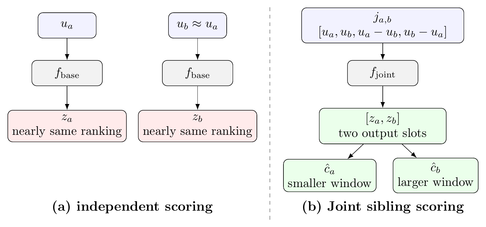
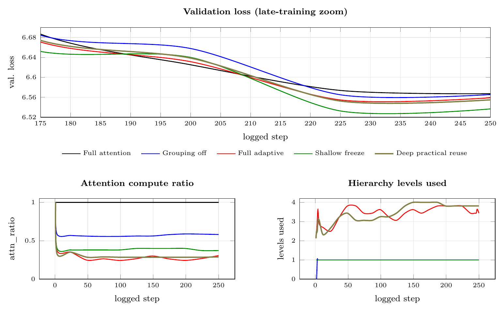
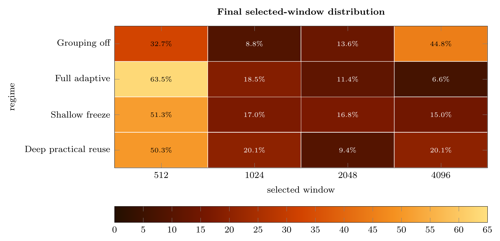

# ENA-AAH-v3

Research code and paper-result summaries for **Asymmetric Attention Heads
(AAH-v3)**, an execution-aware extension of multi-head attention. AAH-v3 keeps
the standard Transformer block interface while using a separate control path to
assign different local causal attention windows to different heads or head
groups.

<p align="center">
  <a href="#overview">Overview</a> |
  <a href="#aah-v3-control-path">Method</a> |
  <a href="#results">Results</a> |
  <a href="#setup">Setup</a> |
  <a href="#citation">Citation</a>
</p>

<p align="center">
  Standard MHA versus AAH-v3. AAH-v3 preserves the Q/K/V projection and flat
  Transformer output interface, while adding a control branch that assigns
  per-head local attention windows before grouped causal execution.
</p>

This is the official repository for **Asymmetric Attention Heads (AAH-v3)**,
an execution-aware extension of multi-head attention. AAH-v3 keeps the standard
Transformer block interface while using a separate control path to assign
different local causal attention windows to different heads or head groups.

This release includes implementation code, compact result summaries, and
paper-facing diagnostics. It does not include large model checkpoints, raw W&B
run directories, local virtual environments, or server credentials.

## Overview

Standard multi-head attention applies the same full causal attention span to
every head. AAH-v3 preserves the usual Q/K/V projections and flat output
interface, but adds a controller that builds head/group features, applies
hierarchy-constrained window decisions, buckets heads by selected local window,
and executes grouped causal local attention.

The AAH control policy is separated from the attention kernel. The reference
backend, `dense_masked`, is kept for correctness checks and attention-map
diagnostics. Hardware-oriented 8192-token configs can instead use
`aah_v3_attention_backend: flash_attn` or
`aah_v3_attention_backend: flex_attention`, where AAH still chooses per-head
windows and the backend realizes those choices with sliding-window execution.
The 8192 backend suite uses candidate windows `[1024, 2048, 4096, 8192]`.

## AAH-v3 Control Path

The control branch uses smoothed head/group features to choose local attention
windows. AAH-v3's final controller change is wide joint sibling scoring:
paired sibling groups are scored together, so the scorer can directly compare
their features and assign different window budgets.

<p align="center">
  
</p>

For paired siblings, the joint scorer replaces the corresponding independent
logits before the raw argmax window decision. Parent constraints then propagate
window choices down the hierarchy before decisions are mapped back to heads.

## Results

### 4096-token controlled AAH-v3 suite

The custom 1B/4096 suite is the main mechanism and efficiency evidence. ACR is
an attention-compute proxy: lower values mean fewer effective attention
positions are evaluated by the executed attention policy.

<p align="center">
  
</p>

The training curves show validation loss, attention compute ratio, and hierarchy
levels used over the logged training trajectory.

<p align="center">
  
</p>

The final selected-window heatmap explains how the compute proxies arise from
the distribution over candidate windows `[512, 1024, 2048, 4096]`.

### Qwen3-4B compatibility snapshot

The Qwen3-4B table is a capped-subset compatibility check for downstream
behavior, not an official full benchmark report.

## What Is Included

- `src/models/transformer.py` contains the decoder-only Transformer baseline
  and the AAH-v3 attention/controller implementation.
- `scripts/train.py` and `scripts/infer.py` are the main local training and
  inference/diagnostic entry points for the custom Transformer runs.
- `scripts/qwen3_aah_patch.py` and `scripts/qwen3_aah_paper.py` contain the
  Qwen3-4B compatibility utilities used for the capped downstream checks.
- `configs/` contains experiment configuration files, including paper-facing
  AAH-v3 regimes and earlier diagnostic variants.
- `configs/paper_8192_backends/` contains FlashAttention and PyTorch
  FlexAttention 8192-token comparison configs.
- `paper_results/` contains compact paper-facing result summaries, tables, and
  diagnostic CSVs that are small enough to version.

## What Is Not Included

- `.pt` checkpoints and adapter weights.
- Raw W&B run directories.
- Local logs, scratch outputs, and Python virtual environments.
- Datasets or downloaded Hugging Face model weights.

For release-quality reproduction, store large artifacts in an external artifact
store and record immutable hashes or model revisions. The paper appendix lists
remaining provenance fields that should be filled before claiming independent
reproducibility.

See `REPRODUCIBILITY.md` for the precise scope of the released artifacts and
`PUBLIC_RELEASE.md` for the safe public-release checklist.

## Setup

Use Python 3.10+ with PyTorch. A minimal local setup is:

```bash
python -m pip install -r requirements.txt
```

The real local-window backends are optional. Install FlashAttention or use a
PyTorch build that exposes `torch.nn.attention.flex_attention` before running
the 8192-token backend configs; otherwise AAH falls back to `dense_masked` and
records the fallback reason.

For Featurize-style remote runs, keep code and important model artifacts under
`/home/featurize/work`, and use `/home/featurize/data` only for fast scratch
storage.

## Typical Commands

Train from a YAML config:

```bash
python scripts/train.py --config configs/aah_v3_base.yaml
```

Run inference and collect diagnostics:

```bash
python scripts/infer.py --config configs/aah_v3_base.yaml --checkpoint path/to/checkpoint.pt
```

Run the Qwen3-4B AAH paper workflow:

```bash
python scripts/run_qwen3_aah_paper.py --benchmark-profile fast_paper
```

Exact flags may differ by config and checkpoint layout; inspect the target
script's `--help` output before launching expensive runs.

## Paper Result Files

Key compact result files are:

- `paper_results/aah_v3_4096_table1_training.csv`
- `paper_results/aah_v3_4096_table2_inference.csv`
- `paper_results/wandb_results_new/`
- `paper_results/qwen3_4b_aah/benchmarks/benchmark_paper_table.md`
- `paper_results/qwen3_4b_aah/benchmarks/benchmark_paper_table.tex`

The Qwen3 benchmark table is a capped-subset compatibility check, not an
official full benchmark report. The custom 1B/4096 suite is the main
mechanism/efficiency evidence for ACR and hierarchy diagnostics.

## License

This repository is released under the Apache License 2.0. See `LICENSE`.

Machine-readable citation metadata is provided in `CITATION.cff`. Update it
with the final arXiv identifier before the public release.

## Repository Release Checklist

Before making the repository public:

1. Add the final arXiv citation and link.
2. Confirm the paper's unresolved provenance fields are either completed or
   clearly marked as limitations.
3. Keep checkpoints out of Git; publish large artifacts through an artifact
   store with SHA-256 hashes.
4. Verify no private tokens, server passwords, raw W&B credentials, or local
   machine paths are committed.

## Citation

The arXiv record is not public yet. Use this placeholder until the final record
exists:

```bibtex
@misc{zhao2026aahv3,
  title  = {Asymmetric Attention Heads: Hierarchical Group-Level Control for Quality-Constrained Attention Compute Efficiency},
  author = {Zimu Zhao},
  year   = {2026},
  note   = {arXiv preprint, forthcoming}
}
```
